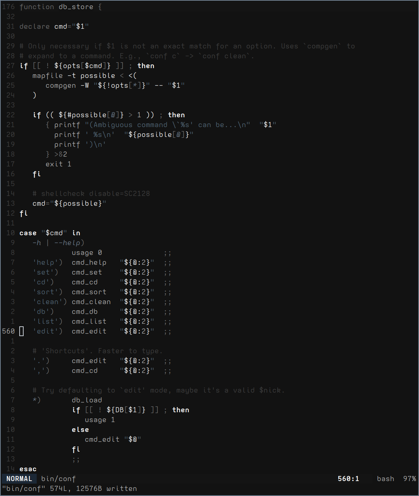

# README
My terminal & (n)vim color schemes, and thoughts on them.

# Philosophy 
1. Colors must aid in understanding of the text
2. Color emphasis should mirror code importance

# Vim

# Terminal

